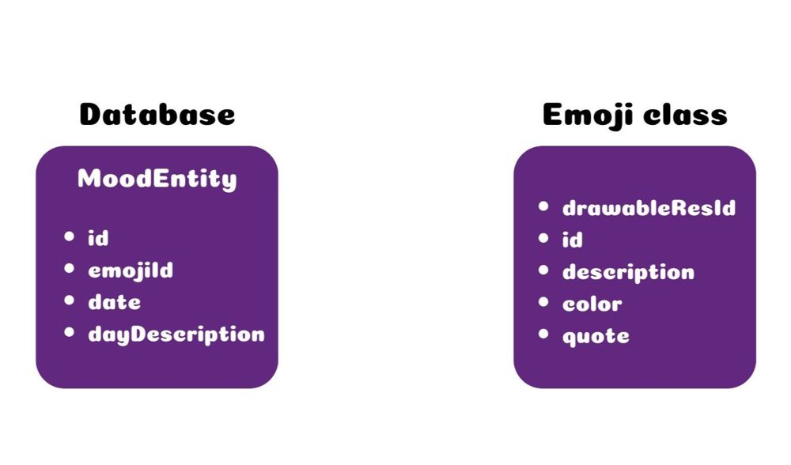

## App Name: MoodMoji

## Team Members
- Nicoleta Dublea
- Sara Beslic

## Description
The cute animated design-inspired mood-tracking app allows users to input their daily thoughts and emotions through emojis and journal writing.

## App Concept
**Use Case**: The app helps users develop a habit of self-reflection and emotional awareness by providing a simple, visually appealing way to track their daily moods and thoughts.
Individuals aged 13 and above who enjoy introspection and journaling, as well as those seeking a supportive tool to track and better understand their emotions.

## High fidelity prototype

## User Flow Diagram

## Usability Test
[Download the Usability Test](MoodMojiUsabilityTest.pdf)

## MoodMoji Development Process 
The development process for MoodMoji was fast-paced and efficient, taking us just under two weeks, as initially planned for the Code Lab. We started by dividing the tasks between us, so we knew exactly what each of us had to focus on.

By day 3, we had already set up the database and completed most of the design, along with a few smaller details. By the end of the first week, the app was nearly done. We only had a few minor issues left to address and the user testing to go through.

By the day before our final presentation, the app was fully functional. We managed to test it with five users, all the features were working smoothly, and the app was ready to be downloaded.

## Database 

The MoodEntity ID is auto-generated and distinct from the emoji ID. The EmojiId corresponds to the Emoji class, EmojiId=id(Emoji class), which is assigned a number ranging from 1 to 12. The properties associated with each emoji are retrieved from the database based on the saved EmojiId.

## Heuristic Evaluation During App Development
**1. Visibility of System Status**

No major issues found.

**2. Match Between System and Real World**

No major issues found.

**3. User Control and Freedom**

**Issue:** Users can easily edit or delete mood entries easily, but there’s no confirmation dialogue after deleting an entry. 

**Solution:** Adding a confirmation dialog for delete actions to avoid accidental loss of data. 

**4. Consistency and Standards**

No major issues found.

**5. Error Prevention**

**Issue:** The app prevents invalid inputs by disabling the "Add Mood" button if no emoji is selected, but the journal field doesn’t validate excessive input. 

**Solution:** Adding input length limits or warnings for the journal field to prevent saving excessively long entries. 

**6. Recognition Rather Than Recall**

No major issues found.

**7. Flexibility and Efficiency of Use**

**Issue:** Basic users can track moods quickly, but advanced users may find it difficult to analyse trends over time without detailed reports.

**Solution:** Adding optional features like mood graphs or filters for advanced users. 

**8. Aesthetics and Minimalist Design**

No major issues found.

**9. Help Users Recognize, Diagnose, and Recover from Errors**

**Issue:** There are no error messages or warning when deleting an entry. 

**Solution:** Considering to add error messages. 

**10. Help and Documentation**

No major issues found.

**Strenghts:** 
- The use of emojis for mood tracking is intuitive, making it engaging and easy for users to understand and interact with.
- A clean and consistent design across the app improves usability and reduces cognitive load.

**Weaknesses:**
- Some actions, like deleting entries, lack a confirmation step, which could lead to accidental mistakes.
- The app currently offers a limited set of features, which may not fully meet the needs of users looking for deeper emotional analysis or reporting.

## Test Setup
The usability test was conducted with 5 participants, focusing on understanding how they interact with the app and identifying any usability issues in the user flow, focusing on tasks such as adding an entry with an emoji and notes, editing and deleting a journal entry and more.

## Target Group
- Age: 13+
- Interests: Mood tracking, self-reflection, journaling

## Hypothesis and Questions
**Hypotheses**:
1. Journaling alongside emojis will enhance users’ reflection on their emotions, encouraging deeper self-awareness.
2. The calendar-based navigation system will allow users to easily access and navigate their mood records over time.

**Questions**:
1. Do the emojis encourage consistent mood tracking over time?
2. Are users able to complete the "Add Mood" and "Update" actions without external help?

## Metrics
1. SUS Score
2. Task Completion Rate
3. Qualitative Feedback

## Tasks
**Task 1:** Open the calendar and select a date to view its details;

**Task 2:** Add a new mood for today and write a short note;

**Task 3:** Update an old journal entry;

**Task 4:** Delete today's entry; 

**Task 5:** Edit a journal entry through the journal view.

After all of the tasks were realized, testers were given a SUS and post-task questionnaire.

## Results

**1. SUS Scores**

To assess overall usability, we conducted a SUS survey after all of the tasks were performed. We achieved an average score of **90.5** (Excellent), with the highest score being **97.5** (Excellent) and the lowest being **70** (Good).

**2. Task Completion Rate**

During the testing process, all participants succesfully completed their tasks, resulting in a 100% task completion rate. This high success rate indicates that the app’s features are easy to understand and interact with.

**3. Qualitative Feedback**

To complement the quantitative results, we collected user feedback on their experience navigating and using the app using a post task questionnaire.

- 4 users for the app very easy to naviagte
  
- 1 user found the app easy to navigate

Most users found the navigation smooth and effortless, appreciating the layout and design. The calendar view was especially well-received.

- 4 users for the app very easy to use
  
- 1 user found the app easy to use

MoodMoji was generally described as straightforward. Users liked the emoji-based mood tracking, finding it a fun and simple way to log emotions and record their feelings.

- 3 users didn't encounter any difficulties while performing the tasks
  
- 2 users encountered some difficulties while performing the tasks

The users who didnt encounter any difficulties found the app self-explanatory, while the users who found them, one explained that the keyboard layout was a problem and the other said that he wasn't aware of the current date and the date he chooses. The problem wasn't actually from our side, since the day gets higlighted with a green stroke when pressing on it.

**Users feedback:**

- App is easy to use and convenient;
- Moods variety;
- Liked the style, calendar view looks great and the mood view;
- Mood entries;
- The "encouragement" messages users get when they log their mood.

**Areas of improvement**

- Some emojis are not understandable;
- The order of the "delete" and "save" buttons should be switched.

**Users suggestions**

- Better choice of emojis;
- More feedback from the app;
- Switching the buttons order;
- Keyboard layout covered a button;
- Allow users to add their own emojis;
- Have a bigger moods selection;
- Other people to see their mood.

Based on user feedback and the initial heuristic evaluation we performed during the app development, we expanded and refined the mood choices, and went from 9 to 12, but switched some moods with better choices. We also added more feedback from the app when not registering an emoji, or when the user wants to delete an entry. The buttons order was also switched for better usability.

## Final App 

## Contributions
**Sara**-Designed and integrated the database, implemented the calendar view UI and logic, developed the journal feature, managed navigation, created the emoji object and applied its properties across the app, contributed to testing, and worked on the landing screen.

**Nicoleta** – Designed the high-fidelity Figma prototype, integrated navigation with pop-up windows, refined design details throughout the app, implemented the confirmation dialog box, prepared emoji images, performed the usability test and tested design responsiveness across different phone sizes.

**Together** – Worked on pop-up windows, conducted testing, and collaborated on design ideas.

## Final Thoughts
The final version of MoodMoji aligned perfectly with our initial concept. Throughout development, we made meaningful improvements, such as refining the mood selection and enhancing user feedback. However, there’s still some room for growth. Future improvements could include:

- More customization options such as user profile, themes;
- Adding graphics, statistics.

This project was a valuable learning experience for both of us since it was the first time we had to work on a Code Lab together. Despite that, we quickly adapted to each other’s working styles, divided tasks efficiently, and managed our time well enough to finish everything in time. Collaborating on both the technical and design aspects helped us improve our skills, and we’re proud of how smoothly we structured the entire process. We achieved our initial goal creating a functional and engaging mood-tracking app—while also learning and improving along the way.
